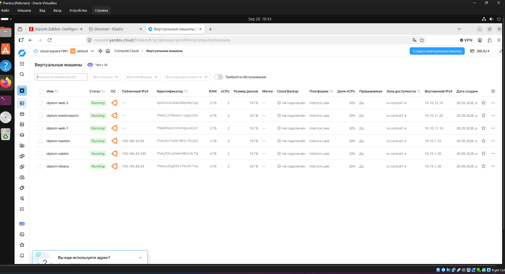
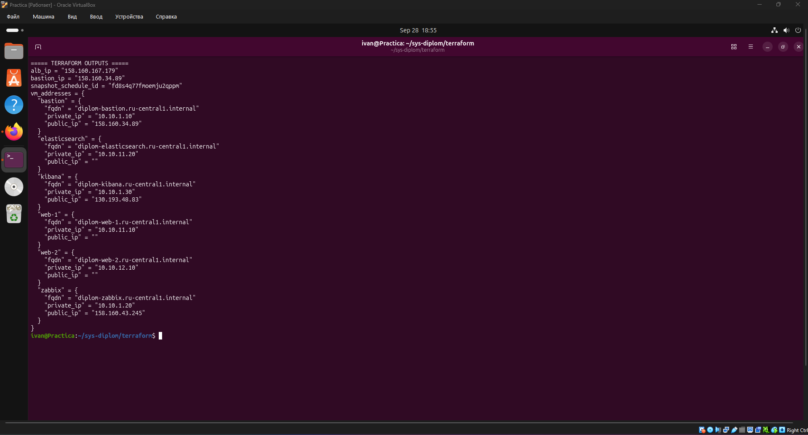
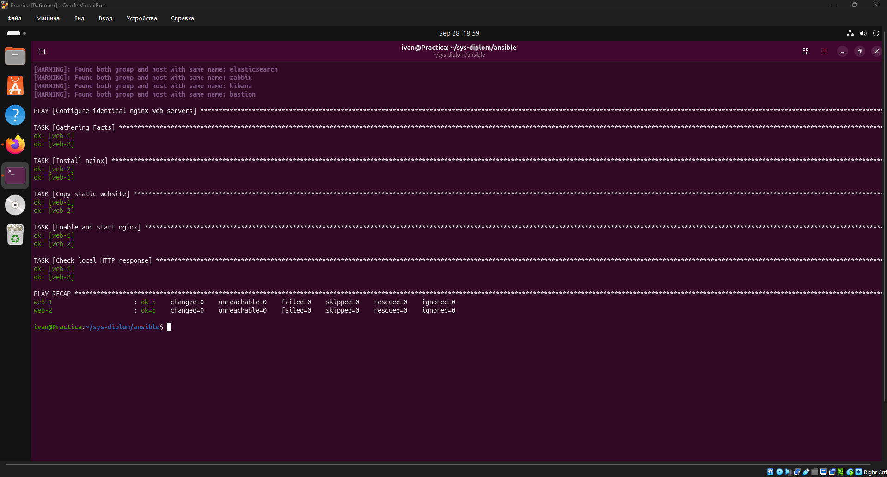
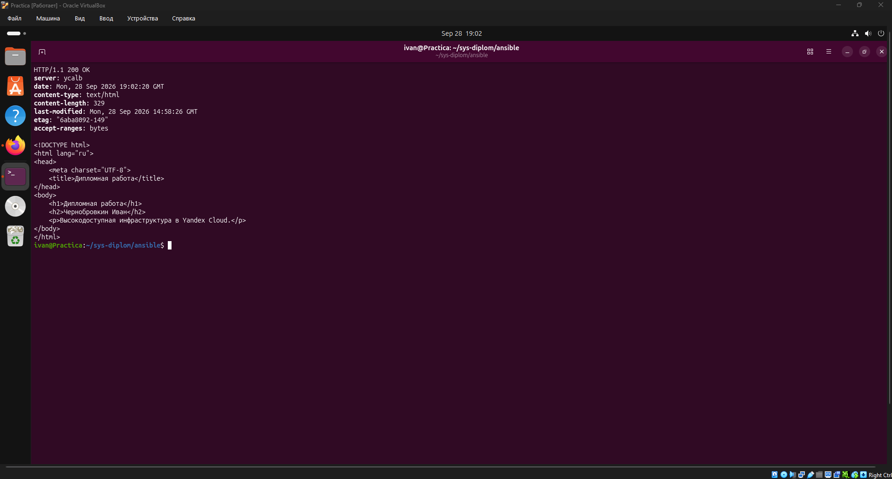
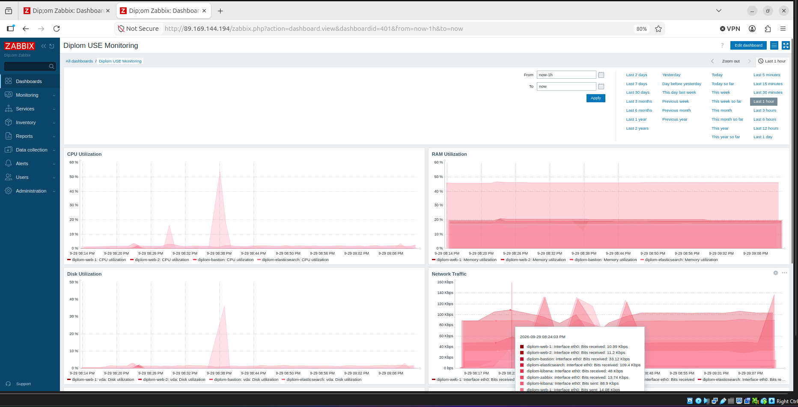
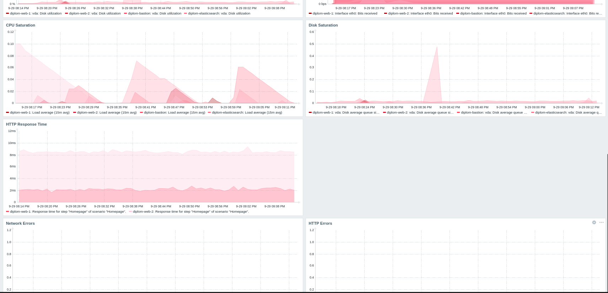
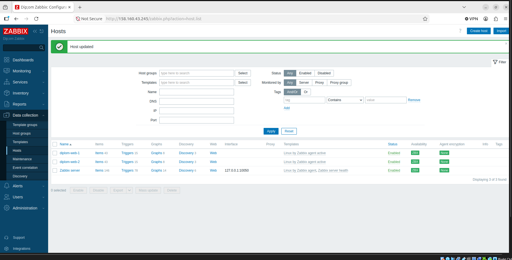
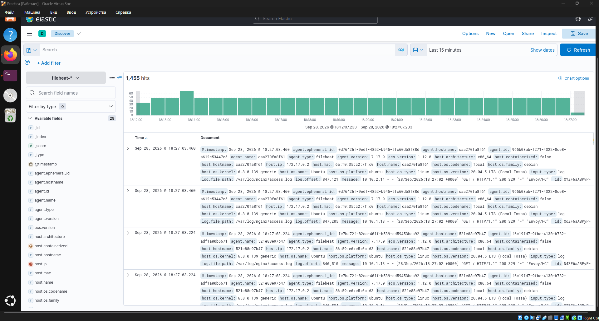
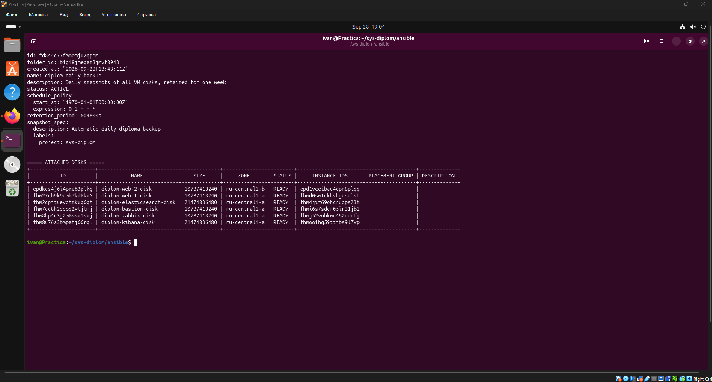

# Дипломная работа — системный администратор

**Автор:** Чернобровкин Иван

Проект представляет собой отказоустойчивую инфраструктуру в Yandex Cloud, развёрнутую с помощью Terraform и настроенную с использованием Ansible.

## Доступ к ресурсам

- Сайт: http://158.160.219.172/
- Zabbix: http://89.169.144.194/
- Kibana: http://93.77.180.204:5601/

Для проверки дипломной работы веб-интерфейсы Zabbix и Kibana доступны извне.

SSH-доступ к виртуальным машинам ограничен правилами Security Groups и осуществляется через bastion-host.

Elasticsearch и внутренние сервисы не публикуются напрямую в интернет.

## Архитектура

В инфраструктуре используются следующие виртуальные машины:

- Bastion host
- Web Server 1
- Web Server 2
- Zabbix Server
- Elasticsearch
- Kibana

Web-серверы размещены в разных зонах доступности и работают за Application Load Balancer.

Доступ к внутренним виртуальным машинам по SSH осуществляется через bastion-host.

Ansible inventory использует внутренние FQDN вида `.ru-central1.internal`, а подключение к приватным ВМ выполняется через `ProxyCommand`.

Перед сдачей все 6 виртуальных машин переведены в непрерываемый режим: `preemptible = false`.

## Используемые технологии

- Yandex Cloud
- Terraform
- Ansible
- nginx
- Application Load Balancer
- Zabbix 7
- PostgreSQL
- Elasticsearch 7.17.9
- Kibana 7.17.9
- Filebeat 7.17.9
- Docker
- Ubuntu 24.04
- Yandex Cloud Snapshot Schedule

## Terraform

Terraform используется для автоматического создания облачной инфраструктуры:

- виртуальной сети и подсетей;
- виртуальных машин;
- security groups;
- Application Load Balancer;
- target group;
- HTTP router;
- backend group;
- автоматического расписания резервного копирования.

Финальный `terraform plan`:

```text
No changes. Your infrastructure matches the configuration.
```

### Созданные виртуальные машины



### Terraform outputs



## Ansible

Ansible используется для настройки серверов после создания инфраструктуры.

С его помощью выполняется:

- установка и настройка nginx;
- размещение веб-страницы на двух web-серверах;
- установка Zabbix Server;
- установка Zabbix Agent 2;
- развёртывание Elasticsearch;
- развёртывание Kibana;
- установка и настройка Filebeat.

Повторный запуск playbook для web-серверов завершается без ошибок и без необходимости внесения изменений.



## Application Load Balancer

Входящий HTTP-трафик распределяется между двумя nginx web-серверами через Yandex Application Load Balancer.

Проверка HTTP-запроса возвращает:

- HTTP 200 OK;
- ответ от Yandex Cloud ALB;
- веб-страницу проекта.



## Мониторинг — Zabbix

Для мониторинга инфраструктуры используется Zabbix.

Zabbix Agent 2 установлен на всех 6 виртуальных машинах и работает в active mode. Агенты отправляют метрики на `diplom-zabbix.ru-central1.internal`.

Используется шаблон:

`Linux by Zabbix agent active`

Для `web-1` и `web-2` настроены Web scenarios `Homepage` с проверкой HTTP 200.

Dashboard `Diplom USE Monitoring` содержит CPU/RAM/Disk Utilization, Network Traffic, CPU/Disk Saturation, Network Errors, HTTP Response Time и HTTP Errors.

### Zabbix Dashboard



### Контролируемые хосты



## Централизованное логирование

Для сбора и просмотра логов используются:

- Filebeat;
- Elasticsearch;
- Kibana.

Filebeat установлен на обоих web-серверах и собирает:

- `/var/log/nginx/access.log`
- `/var/log/nginx/error.log`

Логи передаются в Elasticsearch и доступны для просмотра через Kibana Discover.



## Резервное копирование

Для дисков виртуальных машин настроено автоматическое создание snapshot.

Параметры:

- статус расписания: `ACTIVE`;
- запуск: ежедневно;
- срок хранения: 7 дней;
- в расписание включены диски всех 6 виртуальных машин;
- созданные snapshot проверены в состоянии `READY`.



## Безопасность

Для разделения доступа используются Security Groups.

Основные принципы:

- внутренние серверы не имеют публичного SSH-доступа;
- подключение выполняется через bastion-host;
- Elasticsearch доступен только внутри инфраструктуры;
- web-серверы получают HTTP-трафик через Application Load Balancer;
- секретные файлы, Terraform State, tfvars и приватные ключи исключены из Git с помощью `.gitignore`.

## Структура проекта

    sys-diplom/
    ├── ansible/
    │   ├── elasticsearch.yml
    │   ├── filebeat.yml
    │   ├── inventory.ini
    │   ├── kibana.yml
    │   ├── web.yml
    │   ├── zabbix.yml
    │   ├── zabbix_agents.yml
    │   └── files/
    │       └── site/
    │           └── index.html
    │
    ├── terraform/
    │   ├── alb.tf
    │   ├── backup.tf
    │   ├── compute.tf
    │   ├── network.tf
    │   ├── outputs.tf
    │   ├── providers.tf
    │   ├── security_admin.tf
    │   ├── security_logs.tf
    │   ├── security_web.tf
    │   └── variables.tf
    │
    ├── screenshots/
    └── README.md

## Результат

В результате выполнения проекта была создана инфраструктура в Yandex Cloud с двумя web-серверами за балансировщиком нагрузки, централизованным мониторингом, сбором логов и автоматическим резервным копированием.

Инфраструктура создаётся Terraform, а настройка программного обеспечения выполняется Ansible.
